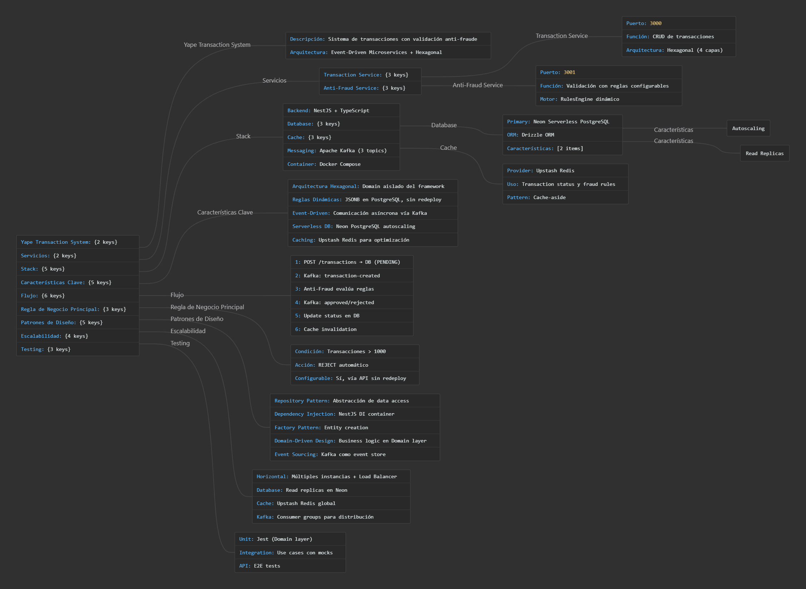
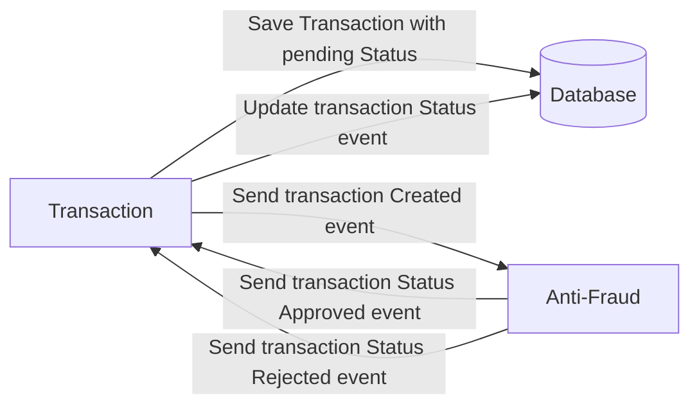

# Sistema de Transacciones - Yape Code Challenge

Sistema de procesamiento de transacciones con validación anti-fraude usando microservicios, arquitectura hexagonal y comunicación event-driven.

[](https://nodejs.org/)
[](https://nestjs.com/)
[](https://www.postgresql.org/)
[](https://kafka.apache.org/)
[](https://www.docker.com/)

## Índice

- [Inicio Rápido](#inicio-rápido)
- [Arquitectura](#arquitectura)
- [Documentación](#documentación)
- [Testing](#testing)
- [Comandos](#comandos-principales)
- [Problem](#problem)
- [Tech Stack](#tech-stack)
- [Send us your challenge](#send-us-your-challenge)

---

## Inicio Rápido

### Prerrequisitos
- **Node.js 18+**
- **Docker & Docker Compose**
- **PostgreSQL** (opcional, se puede usar Docker)

### Instalación y Ejecución

```bash
# 1. Clonar el repositorio
git clone <tu-fork-url>
cd app-nodejs-codechallenge

# 2. Instalar dependencias
npm install

# 3. Configurar variables de entorno
cp .env.example .env
# Editar .env con tus configuraciones

# 4. Levantar infraestructura externa (Docker)
docker-compose up -d

# 5. Inicializar base de datos
npm run db:push

# 6. Cargar reglas de anti-fraude por defecto
npm run seed:fraud-rules

# 7. Iniciar servicios
npm run start:dev
```

### Verificar Instalación
```bash
# Health checks
curl http://localhost:3000/health  # Transaction Service
curl http://localhost:3001/health  # Anti-Fraud Service

# Crear una transacción de prueba
curl -X POST http://localhost:3000/transactions \
  -H "Content-Type: application/json" \
  -d '{
    "accountExternalIdDebit": "550e8400-e29b-41d4-a716-446655440000",
    "accountExternalIdCredit": "550e8400-e29b-41d4-a716-446655440001",
    "tranferTypeId": 1,
    "value": 500
  }'
```

### Servicios Disponibles
| Servicio | URL | Descripción |
|----------|-----|-------------|
| **Transaction Service** | http://localhost:3000 | API de transacciones |
| **Anti-Fraud Service** | http://localhost:3001 | Validación anti-fraude |
| **Kafka UI** | http://localhost:9000 | Monitor de mensajes |
| **Grafana** | http://localhost:3002 | Dashboards (admin/admin) |

---

## Arquitectura

### Vista General


### Microservicios
- **Transaction Service** (3000): Gestión de transacciones + eventos Kafka
- **Anti-Fraud Service** (3001): Motor de reglas configurables (Umbral de monto prioritario) + auditoría

### Patrones Implementados
- **Hexagonal Architecture**: Domain, Application, Infrastructure, Presentation
- **Domain-Driven Design**: Bounded contexts y ubiquitous language
- **Event-Driven**: Kafka para comunicación asíncrona
- **Repository Pattern**: Abstracción de persistencia

### Stack Técnico
| Categoría | Tecnología |
|-----------|-----------|
| Framework | NestJS 11 + TypeScript |
| Base de Datos | PostgreSQL 14 + Drizzle ORM |
| Mensajería | Apache Kafka 2.8 |
| Cache | Redis |
| Observabilidad | OpenTelemetry + Grafana + Tempo |
| DevOps | Docker + Docker Compose |

**Ver:** [Arquitectura detallada en docs/GUIDE.md](docs/GUIDE.md)

---

## Documentación

| Documento | Descripción |
|-----------|-------------|
| **[INDEX.md](docs/INDEX.md)** | Índice de documentación técnica |
| **[GUIDE.md](docs/GUIDE.md)** | Arquitectura hexagonal y patrones de diseño |
| **[FRAUD_RULES.md](docs/FRAUD_RULES.md)** | Motor de reglas anti-fraude configurables |
| **[API-TESTING.md](docs/API-TESTING.md)** | Guía de testing con curl y scripts |
| **[Postman Collection](docs/collection/RETO%20YAPE.postman_collection.json)** | Colección de Postman para pruebas de API |

---

## Testing

```bash
# Tests unitarios
npm test                  # Ejecutar todos los tests
npm run test:cov          # Con coverage
npm run test:watch        # Modo watch

# Test de integración (API)
npm run test:api          # Script bash para probar APIs

# Tests E2E
npm run test:e2e
```

**Pruebas manuales con curl:**
```bash
# Consultar transacción (Verificar estado)
curl http://localhost:3000/transactions/{transactionExternalId}

# Crear transacción
curl -X POST http://localhost:3000/transactions \
  -H "Content-Type: application/json" \
  -d '{"accountExternalIdDebit": "acc-001", "accountExternalIdCredit": "acc-002", "tranferTypeId": 1, "value": 500}'
```

---

## Comandos Principales
```bash
# Desarrollo
npm run start:dev              # Iniciar ambos servicios
npm run start:transaction:dev  # Solo Transaction Service
npm run start:anti-fraud:dev   # Solo Anti-Fraud Service

# Base de datos
npm run db:push               # Aplicar schema
npm run db:studio             # GUI de base de datos
npm run seed:fraud-rules      # Cargar reglas anti-fraude

# Calidad de código
npm run check:fix             # Lint + format (automático)
```

### Estructura del Proyecto
```
app-nodejs-codechallenge/
├── apps/
│   ├── transaction-service/         # Servicio principal de transacciones
│   │   └── src/
│   │       ├── domain/              # Entidades y lógica de negocio
│   │       │   ├── entities/        # Transaction, TransactionStatus
│   │       │   ├── repositories/    # Interfaces de repositorios
│   │       │   └── value-objects/   # Objetos de valor inmutables
│   │       ├── application/         # Casos de uso
│   │       │   ├── use-cases/       # CreateTransaction, GetTransaction
│   │       │   └── dto/             # Data Transfer Objects
│   │       ├── infrastructure/      # Implementaciones técnicas
│   │       │   ├── database/        # Drizzle ORM, schemas, repositories
│   │       │   ├── kafka/           # Producers, consumers, eventos
│   │       │   └── cache/           # Redis adapter
│   │       ├── presentation/        # Capa de API
│   │       │   ├── controllers/     # REST endpoints
│   │       │   └── dto/             # Request/Response DTOs
│   │       └── config/              # Configuración de NestJS
│   │
│   └── anti-fraud-service/          # Servicio de validación anti-fraude
│       └── src/
│           ├── domain/              # Motor de reglas
│           │   ├── entities/        # FraudRule, RuleExecution
│           │   ├── services/        # FraudEvaluator
│           │   └── repositories/    # Interfaces
│           ├── application/         # Evaluación de transacciones
│           │   └── use-cases/       # EvaluateTransaction
│           ├── infrastructure/      # Implementaciones
│           │   ├── database/        # Schemas, repositories
│           │   └── kafka/           # Consumers, producers
│           └── config/              # Configuración
│
├── libs/
│   ├── common/                      # Código compartido
│   │   ├── utils/                   # Helpers y utilidades
│   │   ├── exceptions/              # Excepciones personalizadas
│   │   └── interfaces/              # Interfaces comunes
│   └── observability/               # Telemetría y monitoreo
│       ├── logging/                 # Pino logger configurado
│       ├── tracing/                 # OpenTelemetry setup
│       └── metrics/                 # Métricas de aplicación
│
├── config/                          # Configuración global
│   ├── drizzle.config.ts           # ORM configuration
│   └── jest.config.js              # Test configuration
│
├── test/
│   └── api/                        # Tests de integración
│       └── test-transaction-api.sh
│
├── docs/                           # Documentación técnica
├── observability/                  # Dashboards y configuración
└── docker-compose.yml              # Infraestructura local
```

### Variables de Entorno
Ver [.env.example](.env.example) para configuración completa.

---

# Problem

Every time a financial transaction is created it must be validated by our anti-fraud microservice and then the same service sends a message back to update the transaction status.
For now, we have only three transaction statuses:

<ol>
  <li>pending</li>
  <li>approved</li>
  <li>rejected</li>  
</ol>

Every transaction with a value greater than 1000 should be rejected.



# Tech Stack

| Categoría | Tecnología |
|-----------|-----------|
| **Backend** | Node.js 18+ · NestJS 11 · TypeScript |
| **Base de Datos** | PostgreSQL 14 · Drizzle ORM |
| **Mensajería** | Apache Kafka 2.8 · Redis |
| **Observabilidad** | OpenTelemetry · Grafana · Tempo · Pino · Sentry |
| **Testing** | Jest · Supertest · Biome |
| **DevOps** | Docker · Docker Compose |

## APIs

**Transaction Service (3000):**
- `POST /transactions` - Crear transacción
- `GET /transactions/:id` - Obtener transacción por ID
- `GET /health` - Health check

**Anti-Fraud Service (3001):**
- `GET /health` - Health check

**Eventos Kafka:**
- `transaction-created` → `transaction-approved/rejected`

You must have two resources:

1. Resource to create a transaction that must containt:

```json
{
  "accountExternalIdDebit": "Guid",
  "accountExternalIdCredit": "Guid",
  "tranferTypeId": 1,
  "value": 120
}
```

2. Resource to retrieve a transaction

```json
{
  "transactionExternalId": "Guid",
  "transactionType": {
    "name": ""
  },
  "transactionStatus": {
    "name": ""
  },
  "value": 120,
  "createdAt": "Date"
}
```

## Optional

**High Volume Scenarios:**
- **Write optimization**: Kafka para ingesta asíncrona, PostgreSQL con índices optimizados
- **Read optimization**: Redis cache, read replicas, CQRS pattern
- **Escalabilidad**: Microservicios independientes, stateless design

**GraphQL**: No implementado en esta versión (REST API)

---

# Send us your challenge

When you finish your challenge, after forking a repository, you **must** open a pull request to our repository. There are no limitations to the implementation, you can follow the programming paradigm, modularization, and style that you feel is the most appropriate solution.

If you have any questions, please let us know.

---

## Notas de Implementación

Implementación:
- Cumple todos los requerimientos del challenge
- Arquitectura hexagonal + DDD
- Sistema de reglas anti-fraude extensible
- Observabilidad con OpenTelemetry
- Tests unitarios e integración
- Documentación técnica

**Próximos pasos:**
1. Revisar [docs/INDEX.md](docs/INDEX.md) para documentación completa
2. Ejecutar `npm run test:api` para probar las APIs
3. Explorar Grafana en http://localhost:3002
