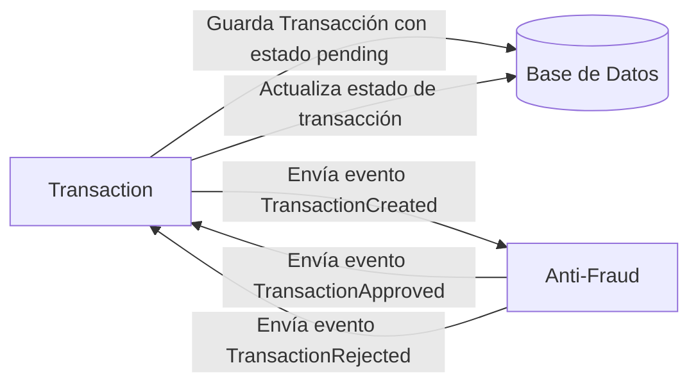

# Sistema de Transacciones - Yape Code Challenge

Sistema de procesamiento de transacciones con validación anti-fraude usando microservicios, arquitectura hexagonal y comunicación event-driven.

[](https://nodejs.org/)
[](https://nestjs.com/)
[](https://www.postgresql.org/)
[](https://kafka.apache.org/)
[](https://www.docker.com/)

## Índice

- [Inicio Rápido](#inicio-rápido)
- [Arquitectura](#arquitectura)
- [Documentación](#documentación)
- [Testing](#testing)
- [Comandos](#comandos-principales)
- [Problem](#problem)
- [Tech Stack](#tech-stack)
- [Send us your challenge](#send-us-your-challenge)

---

## Inicio Rápido

### Prerrequisitos
- **Node.js 20+**
- **Docker & Docker Compose**
- **PostgreSQL 14+** (incluido en Docker Compose)

### Instalación y Ejecución

```bash
# 1. Clonar el repositorio
git clone <tu-fork-url>
cd app-nodejs-codechallenge

# 2. Instalar dependencias
npm install

# 3. Configurar variables de entorno
cp .env.example .env
# Editar .env con tus configuraciones

# 4. Levantar infraestructura y servicios (Docker)
# Esto inicializará la base de datos y cargará las reglas automáticamente
docker-compose up --build -d

# 5. (Opcional) Si ejecutas localmente sin Docker Compose:
# npm run db:push
# npm run seed:fraud-rules
# npm run start:dev
```

### Verificar Instalación
```bash
# Crear una transacción de prueba (UUIDs válidos requeridos)
curl -X POST http://localhost:3000/transactions \
  -H "Content-Type: application/json" \
  -d '{
    "accountExternalIdDebit": "550e8400-e29b-41d4-a716-446655440000",
    "accountExternalIdCredit": "550e8400-e29b-41d4-a716-446655440001",
    "tranferTypeId": 1,
    "value": 500
  }'
```

### Servicios Disponibles
| Servicio | URL | Descripción |
|----------|-----|-------------|
| **Transaction Service** | http://localhost:3000 | API de transacciones |
| **Anti-Fraud Service** | http://localhost:3001 | Validación anti-fraude |
| **Kafka UI** | http://localhost:9000 | Monitor de mensajes (Kafka 2.5/5.5.3) |
| **Grafana** | http://localhost:3002 | Dashboards (admin/admin) |

---

## Arquitectura

### Vista General


### Microservicios
- **Transaction Service** (3000): Gestión de transacciones + eventos Kafka.
- **Anti-Fraud Service** (3001): Validación de reglas de negocio. Incluye la **regla obligatoria de umbral de monto (>1000)** y un motor extensible para reglas adicionales (demo).

### Patrones Implementados
- **Hexagonal Architecture**: Domain, Application, Infrastructure, Presentation
- **Domain-Driven Design**: Bounded contexts y ubiquitous language
- **Event-Driven**: Kafka para comunicación asíncrona
- **Repository Pattern**: Abstracción de persistencia

### Stack Técnico
| Categoría | Tecnología |
|-----------|-----------|
| Framework | NestJS 11 + TypeScript |
| Base de Datos | PostgreSQL 14 + Drizzle ORM |
| Mensajería | Apache Kafka 2.8 |
| Cache | Redis |
| Observabilidad | OpenTelemetry + Grafana + Tempo |
| DevOps | Docker + Docker Compose |

**Ver:** [Arquitectura detallada en docs/GUIDE.md](docs/GUIDE.md)

---

## Documentación

| Documento | Descripción |
|-----------|-------------|
| **[INDEX.md](docs/INDEX.md)** | Índice de documentación técnica |
| **[GUIDE.md](docs/GUIDE.md)** | Arquitectura hexagonal y patrones de diseño |
| **[FRAUD_RULES.md](docs/FRAUD_RULES.md)** | Motor de reglas anti-fraude configurables |
| **[API-TESTING.md](docs/API-TESTING.md)** | Guía de testing con curl y scripts |
| **[Postman Collection](docs/collection/RETO%20YAPE.postman_collection.json)** | Colección de Postman para pruebas de API |

---

## Testing

```bash
# Tests unitarios
npm test                  # Ejecutar todos los tests
npm run test:cov          # Con coverage
npm run test:watch        # Modo watch

# Test de integración (API)
npm run test:api          # Script bash para probar APIs

# Tests E2E
npm run test:e2e
```

**Pruebas manuales con curl:**
```bash
# Consultar transacción (Verificar estado)
curl http://localhost:3000/transactions/{transactionExternalId}

# Crear transacción (Usar UUIDs reales)
curl -X POST http://localhost:3000/transactions \
  -H "Content-Type: application/json" \
  -d '{
    "accountExternalIdDebit": "550e8400-e29b-41d4-a716-446655440000",
    "accountExternalIdCredit": "550e8400-e29b-41d4-a716-446655440001",
    "tranferTypeId": 1,
    "value": 500
  }'
```

---

## Comandos Principales
```bash
# Desarrollo
npm run start:dev              # Iniciar ambos servicios
npm run start:transaction:dev  # Solo Transaction Service
npm run start:anti-fraud:dev   # Solo Anti-Fraud Service

# Base de datos
npm run db:push               # Aplicar schema
npm run db:studio             # GUI de base de datos
npm run seed:fraud-rules      # Cargar reglas anti-fraude

# Calidad de código
npm run check:fix             # Lint + format (automático)
```

### Estructura del Proyecto
```
app-nodejs-codechallenge/
├── apps/
│   ├── transaction-service/
│   │   └── src/
│   │       ├── application/
│   │       │   └── use-cases/
│   │       ├── config/
│   │       ├── domain/
│   │       │   ├── entities/
│   │       │   ├── ports/
│   │       │   ├── repositories/
│   │       │   └── value-objects/
│   │       ├── infrastructure/
│   │       │   ├── database/
│   │       │   ├── messaging/
│   │       │   └── repositories/
│   │       └── presentation/
│   │           ├── controllers/
│   │           └── dtos/
│   └── anti-fraud-service/
│       ├── scripts/
│       └── src/
│           ├── application/
│           │   └── use-cases/
│           ├── config/
│           ├── domain/
│           │   ├── entities/
│           │   ├── ports/
│           │   ├── repositories/
│           │   ├── services/
│           │   └── types/
│           └── infrastructure/
│               ├── database/
│               ├── mappers/
│               ├── messaging/
│               └── repositories/
├── libs/
│   ├── common/
│   │   └── src/
│   │       ├── database/
│   │       │   └── schemas/
│   │       ├── events/
│   │       ├── exceptions/
│   │       │   └── filters/
│   │       ├── interceptors/
│   │       ├── kafka/
│   │       ├── redis/
│   │       └── types/
│   └── observability/
│       └── src/
│           ├── adapters/
│           ├── kafka/
│           ├── logging/
│           ├── ports/
│           └── tracing/
├── config/
│   └── database/
├── drizzle/
│   └── meta/
├── docs/
│   ├── collection/
│   └── diagrams/
├── observability/
│   ├── grafana/
│   │   ├── dashboards/
│   │   └── provisioning/
│   └── tempo/
├── test/
│   └── api/
└── docker-compose.yml
```

### Variables de Entorno
Ver [.env.example](.env.example) para configuración completa.

---

# El Problema

Cada vez que se crea una transacción financiera, esta debe ser validada por nuestro microservicio anti-fraude y luego el mismo servicio envía un mensaje de vuelta para actualizar el estado de la transacción.

Por ahora, solo tenemos tres estados de transacción:

<ol>
  <li>pending (pendiente)</li>
  <li>approved (aprobado)</li>
  <li>rejected (rechazado)</li>  
</ol>

Cada transacción con un valor superior a 1000 debe ser rechazada.



# Stack Tecnológico

| Categoría | Tecnología |
|-----------|-----------|
| **Backend** | Node.js 20+ · NestJS 11 · TypeScript |
| **Base de Datos** | PostgreSQL 14 · Drizzle ORM |
| **Mensajería** | Apache Kafka 2.5/5.5.3 · Redis |
| **Observabilidad** | OpenTelemetry · Grafana · Tempo · Pino · Sentry |
| **Testing** | Jest · Supertest · Biome |
| **DevOps** | Docker · Docker Compose |

## APIs

**Transaction Service (3000):**
- `POST /transactions` - Crear transacción
- `GET /transactions/:transactionExternalId` - Obtener transacción por ID externo

**Anti-Fraud Service (3001):**
- Validación interna basada en reglas.

**Eventos Kafka:**
- `transaction-created` → `transaction-approved/rejected`

Se deben tener dos recursos principales:

1. Recurso para crear una transacción que debe contener:

```json
{
  "accountExternalIdDebit": "Guid",
  "accountExternalIdCredit": "Guid",
  "tranferTypeId": 1,
  "value": 120
}
```

2. Recurso para recuperar una transacción:

```json
{
  "transactionExternalId": "Guid",
  "transactionType": {
    "name": ""
  },
  "transactionStatus": {
    "name": ""
  },
  "value": 120,
  "createdAt": "Date"
}
```

## Opcionales (Consideraciones de Diseño)

**Escenarios de Alto Volumen:**
- **Optimización de Escritura**: Kafka para ingesta asíncrona, PostgreSQL con índices optimizados.
- **Optimización de Lectura**: Cache con Redis, réplicas de lectura, patrón CQRS.
- **Escalabilidad**: Microservicios independientes, diseño sin estado (stateless).

---

# Envíanos tu desafío

Cuando termines tu desafío, después de hacer un fork del repositorio, **debes** abrir un pull request a nuestro repositorio. No hay limitaciones para la implementación, puedes seguir el paradigma de programación, la modularización y el estilo que sientas que es la solución más apropiada.

If you have any questions, please let us know.

---

## Notas de Implementación

Implementación:
- **Regla de Negocio**: Se cumple con la validación de transacciones > 1000. Aunque el requerimiento era un monto fijo, se implementó mediante un motor de reglas configurable para demostrar extensibilidad.
- **Arquitectura**: Hexagonal + DDD.
- **Extras**: Se incluyen reglas adicionales de forma demostrativa (blacklist, límites por tipo, etc.) para mostrar cómo el sistema puede evolucionar.
- **Observabilidad**: Implementada con OpenTelemetry.
- **Tests**: Unitarios e integración incluidos.

**Próximos pasos:**
1. Revisar [docs/INDEX.md](docs/INDEX.md) para documentación completa
2. Ejecutar `npm run test:api` para probar las APIs
3. Explorar Grafana en http://localhost:3002
