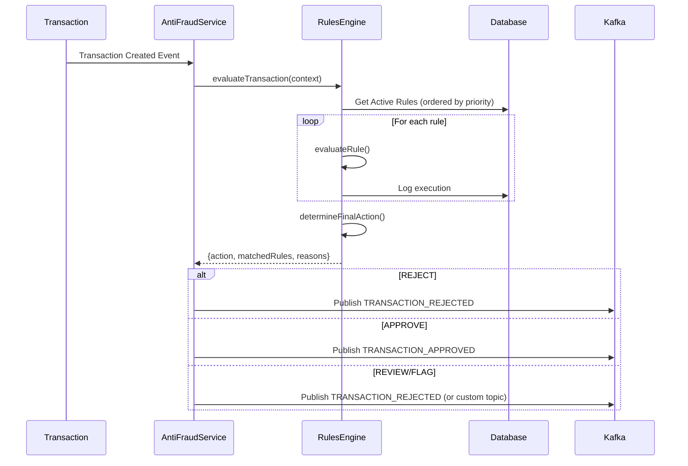

# 🛡️ Sistema de Reglas Anti-Fraude

Sistema configurable para validar transacciones dinámicamente sin código hardcodeado.

## 🎯 Características Principales

- **Sistema extensible** de reglas configurables
- **AMOUNT_THRESHOLD** (único requerido por el reto)
- **5 tipos adicionales** demostrativos de extensibilidad
- **Sistema de prioridades** para resolución de conflictos
- **Gestión vía base de datos** (sin APIs REST)
- **Auditoría completa** de todas las evaluaciones

## 🔧 Tipos de Reglas

| Tipo | Descripción | Estado | Ejemplo de Condición |
|------|-------------|--------|----------------------|
| `AMOUNT_THRESHOLD` | **Umbral de monto (REQUERIDO)** | ✅ Configurable | `{"operator": "gt", "value": 1000}` |
| `DAILY_LIMIT` | Límite diario | 🚧 Demo (pendiente) | `{"maxAmount": 5000, "maxTransactions": 10}` |
| `VELOCITY_CHECK` | Detección de velocidad | 🚧 Demo (pendiente) | `{"maxTransactions": 5, "timeWindowMinutes": 30}` |
| `ACCOUNT_BLACKLIST` | Lista negra | ✅ Implementado | `{"accounts": ["uuid1", "uuid2"]}` |
| `TRANSFER_TYPE_LIMIT` | Límite por tipo | ✅ Implementado | `{"transferTypeId": 2, "maxAmount": 500}` |
| `TIME_BASED` | Restricción horaria | ✅ Implementado | `{"allowedHours": {"start": 8, "end": 18}}` |

## 🎬 Acciones

- **`REJECT`**: Rechaza inmediatamente (prioridad máxima)
- **`REVIEW`**: Marca para revisión manual
- **`FLAG`**: Solo marca sin bloquear
- **`APPROVE`**: Aprueba (prioridad mínima)

## 📊 Esquema de Base de Datos

### fraud_rules
```sql
CREATE TABLE fraud_rules (
  id UUID PRIMARY KEY,
  name VARCHAR(100) NOT NULL,
  description TEXT,
  rule_type VARCHAR(50) NOT NULL,
  condition JSONB NOT NULL,
  action VARCHAR(20) NOT NULL DEFAULT 'REJECT',
  priority INTEGER NOT NULL DEFAULT 100,
  is_active BOOLEAN NOT NULL DEFAULT true,
  created_at TIMESTAMP NOT NULL DEFAULT NOW(),
  updated_at TIMESTAMP NOT NULL DEFAULT NOW()
);
```

### fraud_rule_executions
```sql
CREATE TABLE fraud_rule_executions (
  id UUID PRIMARY KEY,
  rule_id UUID NOT NULL REFERENCES fraud_rules(id),
  transaction_external_id UUID NOT NULL,
  matched BOOLEAN NOT NULL,
  action VARCHAR(20) NOT NULL,
  details JSONB,
  executed_at TIMESTAMP NOT NULL DEFAULT NOW()
);
```

## 🗄️ Gestión de Reglas

### Gestión Actual
Las reglas de fraude se gestionan directamente a través de la base de datos. No hay APIs REST disponibles para gestión en tiempo real.

### Métodos de Gestión
1. **Script de seeding**: `npm run seed:fraud-rules`
2. **Migraciones de base de datos**: Actualizaciones vía SQL/scripts
3. **Acceso directo a BD**: Consultas y modificaciones directas

### Recomendación
Para entornos de producción, considere implementar APIs de gestión o una interfaz administrativa separada.

## 🎯 Flujo de Evaluación



## 🔄 Sistema de Prioridades

- **Menor número = Mayor prioridad**
- Las reglas se evalúan en orden de prioridad
- Todas las reglas se evalúan (no hay short-circuit)
- La acción final se determina con la siguiente prioridad:
  1. `REJECT` (prioridad máxima)
  2. `REVIEW`
  3. `FLAG`
  4. `APPROVE` (prioridad mínima)

## 📝 Configuración Inicial

### 1. Crear las tablas
```bash
npm run db:push
```

### 2. Seed de reglas por defecto
```bash
npm run seed:fraud-rules
```

Esto creará las siguientes reglas:

1. **High Amount Transaction** (Activa)
   - Rechaza transacciones > 1000
   - Prioridad: 100

2. **Very High Amount - Review** (Inactiva)
   - Marca para revisión transacciones > 5000
   - Prioridad: 50

3. **Weekend Transfer Limit** (Inactiva)
   - Rechaza transferencias en fin de semana
   - Prioridad: 200

4. **Payment Type Limit** (Inactiva)
   - Limita pagos (tipo 2) a 500
   - Prioridad: 150

## 💡 Ejemplos de Uso

### Ejemplo 1: Cambiar el umbral de monto

1. Consultar regla actual en base de datos:
```sql
SELECT id, name, condition FROM fraud_rules
WHERE rule_type = 'AMOUNT_THRESHOLD' AND is_active = true;
```

2. Actualizar la condición:
```sql
UPDATE fraud_rules
SET condition = '{"operator": "gt", "value": 2000}',
    updated_at = NOW()
WHERE id = 'rule-id-here';
```

### Ejemplo 2: Habilitar restricción de fin de semana

```sql
UPDATE fraud_rules
SET is_active = true,
    updated_at = NOW()
WHERE name LIKE '%weekend%';
```

### Ejemplo 3: Crear nueva regla de blacklist

```sql
INSERT INTO fraud_rules (
  id, name, description, rule_type, condition, action, priority, is_active
) VALUES (
  gen_random_uuid(),
  'Blocked Accounts',
  'Accounts reported for fraud',
  'ACCOUNT_BLACKLIST',
  '{"accounts": ["550e8400-e29b-41d4-a716-446655440000", "550e8400-e29b-41d4-a716-446655440001"]}',
  'REJECT',
  10,
  true
);
```

## 🔍 Auditoría y Monitoreo

### Ver qué reglas se activaron para una transacción

Las ejecuciones se registran automáticamente en `fraud_rule_executions`:

```sql
SELECT
  fr.name,
  fre.matched,
  fre.action,
  fre.details,
  fre.executed_at
FROM fraud_rule_executions fre
JOIN fraud_rules fr ON fre.rule_id = fr.id
WHERE fre.transaction_external_id = '{transaction-id}'
ORDER BY fre.executed_at;
```

### Estadísticas de una regla

```sql
SELECT
  COUNT(*) as total_executions,
  COUNT(CASE WHEN matched = true THEN 1 END) as matches,
  COUNT(CASE WHEN matched = true AND action = 'REJECT' THEN 1 END) as rejections
FROM fraud_rule_executions
WHERE rule_id = 'rule-id-here'
  AND executed_at >= NOW() - INTERVAL '30 days';
```

## 🛠️ Extensión del Sistema

Para agregar un nuevo tipo de regla:

1. **Agregar al enum** en `fraud-rules.types.ts`
2. **Crear interfaz de condición**
3. **Implementar método evaluador** en `RulesEngineService`
4. **Agregar case al switch**

**Nota**: Actualmente `DAILY_LIMIT` y `VELOCITY_CHECK` están marcados como "implementación pendiente" en el código.
