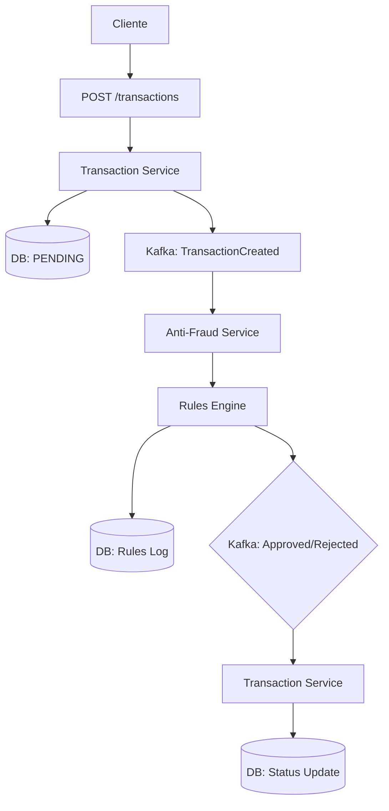

# Guía de Arquitectura

Documentación técnica profunda sobre la arquitectura hexagonal, decisiones de diseño y patrones implementados.

> **Nota:** Para instalación y comandos básicos, ver [README.md](../README.md)

---

## Arquitectura Hexagonal - Visión General

### Principios Fundamentales

La **Arquitectura Hexagonal** (también conocida como **Ports & Adapters**) separa la lógica de negocio de las preocupaciones externas, creando un sistema modular y testeable.

#### 🎯 **Núcleo Independiente**
- **Domain Layer**: Reglas de negocio puras, independientes de frameworks
- **Application Layer**: Casos de uso que coordinan el flujo de la aplicación
- **Ports**: Interfaces que definen contratos para comunicación externa
- **Adapters**: Implementaciones concretas de las interfaces

#### 🔄 **Capas de Adaptación**
- **Infrastructure Layer**: Adaptadores para bases de datos, mensajería, APIs externas
- **Presentation Layer**: Adaptadores para interfaces de usuario (REST APIs, GraphQL, etc.)

### Beneficios Arquitectónicos

| Beneficio | Descripción |
|-----------|-------------|
| **Testabilidad** | Lógica de dominio pura, fácil de testear unitariamente |
| **Mantenibilidad** | Cambios en infraestructura no afectan el dominio |
| **Flexibilidad** | Fácil cambiar tecnologías (DB, mensajería, frameworks) |
| **Escalabilidad** | Servicios independientes, deployment separado |
| **Evolución** | Nuevo comportamiento sin modificar código existente |

---

## Domain-Driven Design (DDD)

### Bounded Contexts

El sistema está dividido en **dos bounded contexts principales**:

#### 1. **Transaction Management** (Contexto Principal)
- **Responsabilidades**: Crear, consultar y gestionar el ciclo de vida de transacciones
- **Entidades**: `Transaction` con estados (PENDING → APPROVED/REJECTED)
- **Value Objects**: `TransactionStatus`, montos, IDs externos
- **Reglas de negocio**: Validaciones básicas, estado de transacciones

#### 2. **Anti-Fraud Validation** (Contexto de Soporte)
- **Responsabilidades**: Evaluación de riesgo basada en reglas configurables
- **Entidades**: `FraudRule`, `FraudRuleExecution`
- **Motor de reglas**: Sistema extensible de validación
- **Auditoría**: Registro completo de todas las evaluaciones

### Strategic Design Patterns

- **Ubiquitous Language**: Terminología consistente (Transaction, FraudRule, etc.)
- **Context Mapping**: Comunicación clara entre bounded contexts vía eventos
- **Aggregate Design**: Entidades con límites claros de consistencia
- **Domain Events**: Comunicación interna dentro de bounded contexts

---

## Event-Driven Architecture

### Patrón de Comunicación Asíncrona

El sistema utiliza **Event-Driven Architecture** para desacoplar servicios y mejorar la resiliencia:

#### 🎯 **Ventajas del Approach**
- **Desacoplamiento**: Servicios no necesitan conocerse mutuamente
- **Escalabilidad**: Procesamiento asíncrono permite manejar picos de carga
- **Resiliencia**: Fallos en un servicio no afectan inmediatamente a otros
- **Evolución**: Nuevos consumidores pueden suscribirse sin modificar productores

#### 📋 **Flujo de Eventos Principal**

#### 🔄 **Eventos del Sistema**
- **`TransactionCreated`**: Nueva transacción requiere validación
- **`TransactionApproved`**: Validación exitosa, transacción aprobada
- **`TransactionRejected`**: Validación fallida, transacción rechazada

### Decisiones de Diseño

#### **Kafka como Message Broker**
- **Durabilidad**: Mensajes persistentes con replicas
- **Orden**: Garantía de orden por partición
- **Escalabilidad**: Consumer groups permiten múltiples instancias
- **Ecosistema**: Amplio soporte y herramientas (Kafka UI, Streams, etc.)

#### **Event Sourcing Considerations**
- **Audit Trail**: Todos los cambios quedan registrados
- **Debugging**: Posibilidad de reconstruir estado desde eventos
- **Analytics**: Eventos pueden alimentar sistemas de BI

---

## Estrategia de Persistencia

### PostgreSQL como Base de Datos Principal

#### **Decisiones de Diseño**
- **Relacional vs NoSQL**: PostgreSQL para consistencia y transacciones ACID
- **Type Safety**: Drizzle ORM para schemas type-safe en TypeScript
- **Migrations**: Schema definido como código, migraciones automáticas

#### **Esquemas Principales**
- **Transacciones**: Entidad principal con estados y metadatos
- **Reglas de Fraude**: Configuración dinámica de reglas de validación
- **Auditoría**: Log completo de evaluaciones para compliance

#### **Patrones de Acceso**
- **Repository Pattern**: Abstracción de acceso a datos
- **Transaction Management**: Operaciones atómicas en base de datos
- **Query Optimization**: Índices y estrategias de consulta eficientes

---

## Observabilidad y Monitoreo

### OpenTelemetry como Estándar

#### **Pilares de Observabilidad**
- **Logs**: Eventos estructurados con contexto (Pino + JSON)
- **Metrics**: Métricas de aplicación y sistema (OpenTelemetry)
- **Traces**: Seguimiento distribuido de requests (Tempo)

#### **Dashboards y Visualización**
- **Grafana**: Métricas en tiempo real y dashboards customizables
- **Tempo**: Tracing distribuido para debugging de requests complejos

#### **Alerting y Error Tracking**
- **Sentry**: Captura automática de errores en producción
- **Log Aggregation**: Centralización de logs para análisis

---

## Pirámide de Testing

### Estrategia Multi-Capa

#### **Unit Tests (Base de la Pirámide)**
- **Domain Layer**: Lógica de negocio pura (entidades, value objects)
- **Cobertura**: 100% en reglas de negocio críticas
- **Framework**: Jest con assertions descriptivas

#### **Integration Tests (Capa Media)**
- **Application Layer**: Casos de uso con dependencias mockeadas
- **Use Cases**: Coordinación entre repositorios y servicios externos
- **External APIs**: Contratos con sistemas de mensajería

#### **E2E Tests (Cima de la Pirámide)**
- **API Endpoints**: Flujos completos desde HTTP hasta base de datos
- **Cross-Service**: Comunicación entre Transaction y Anti-Fraud services
- **Contract Testing**: Validación de interfaces entre servicios

### Decisiones de Testing

#### **Herramientas Seleccionadas**
- **Jest**: Framework moderno con TypeScript support
- **Supertest**: Testing HTTP APIs
- **TestContainers**: Base de datos real para tests de integración

#### **Cobertura y Calidad**
- **Mutation Testing**: Validación de calidad de tests
- **Contract Tests**: Interfaces entre servicios
- **Performance Tests**: Validación de no-regression

---

## Infraestructura de Desarrollo

### Docker Compose para Desarrollo Local

El proyecto incluye configuración completa de **Docker Compose** con todos los servicios necesarios:

#### **Servicios Incluidos**
- **PostgreSQL**: Base de datos relacional
- **Kafka + Zookeeper**: Message broker para comunicación event-driven
- **Redis**: Cache opcional para alta performance
- **Grafana**: Dashboards de métricas
- **Tempo**: Tracing distribuido
- **Kafka UI**: Interfaz web para monitoreo de mensajes

#### **Configuración por Entorno**
- **Desarrollo**: Servicios locales con volúmenes persistentes
- **Testing**: Base de datos efímera para tests de integración
- **Producción**: Configuración optimizada para deployment

### Variables de Entorno

El sistema utiliza **variables de entorno** para configuración flexible:

#### **Grupos de Configuración**
- **Base de Datos**: Conexión PostgreSQL
- **Mensajería**: Brokers Kafka y grupos de consumidores
- **Servicios**: Puertos y URLs de servicios
- **Observabilidad**: Endpoints de Grafana, Tempo, Sentry
- **Logging**: Niveles y formatos de logs

---

## Referencias Técnicas

- [Domain-Driven Design](https://martinfowler.com/bliki/DomainDrivenDesign.html)
- [Hexagonal Architecture](https://alistair.cockburn.us/hexagonal-architecture/)
- [Event-Driven Architecture](https://martinfowler.com/articles/201701-event-driven.html)
- [Repository Pattern](https://martinfowler.com/eaaCatalog/repository.html)
- [Drizzle ORM Documentation](https://orm.drizzle.team/docs/overview)
- [NestJS Documentation](https://docs.nestjs.com/)
- [OpenTelemetry Specification](https://opentelemetry.io/docs/)
